# Telco-Customer-Churn-Prediction

This project aims to predict **customer churn** using the Telco Customer Churn dataset.  
It includes **exploratory data analysis (EDA)**, **data preprocessing**, **visualizations**, and applying multiple **machine learning models** to evaluate performance.

## Project Content
- **ChurnPrediction.ipynb**
  - Data loading and cleaning  
  - Exploratory data analysis (EDA) with visualizations  
  - Data preprocessing (handling missing values, encoding, scaling)  
  - Model training and evaluation  
  - Performance comparison (Accuracy, Precision, Recall, F1-score)  
  - Confusion Matrix and ROC Curve visualizations  

## Machine Learning Models Used
The following models were implemented and compared:
- Logistic Regression  
- K-Nearest Neighbors (KNN)  
- Support Vector Machine (SVM)  
- Decision Tree  
- Random Forest  
- AdaBoost  
- Gradient Boosting  
- Naive Bayes  
- XGBoost  

## Libraries Used
- pandas, numpy  
- matplotlib, seaborn, plotly  
- scikit-learn  
- xgboost  

## Dataset
[Telco Customer Churn - Kaggle](https://www.kaggle.com/datasets/blastchar/telco-customer-churn)

## Requirements
- Python 3.x  
- pandas  
- numpy  
- matplotlib  
- seaborn  
- plotly  
- scikit-learn  
- xgboost  

## Visualizations

### Correlation Matrix
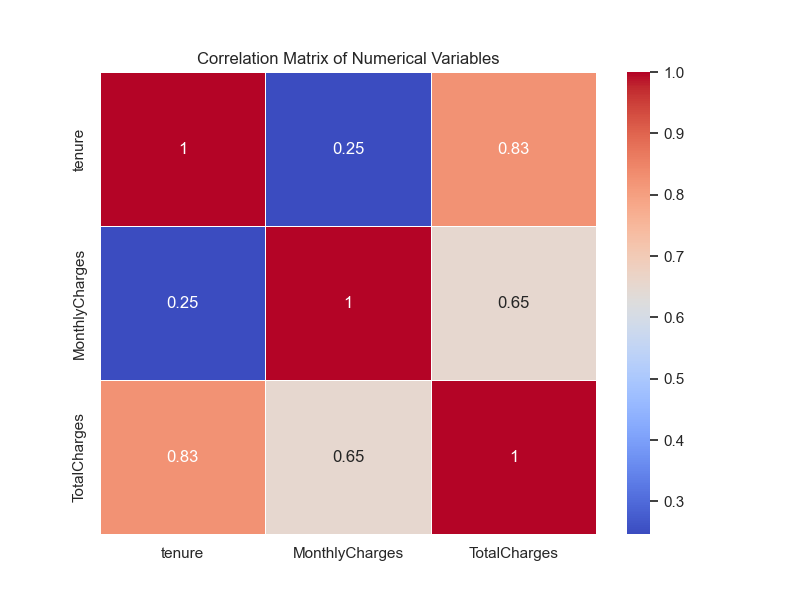

### Categorical Features vs Churn
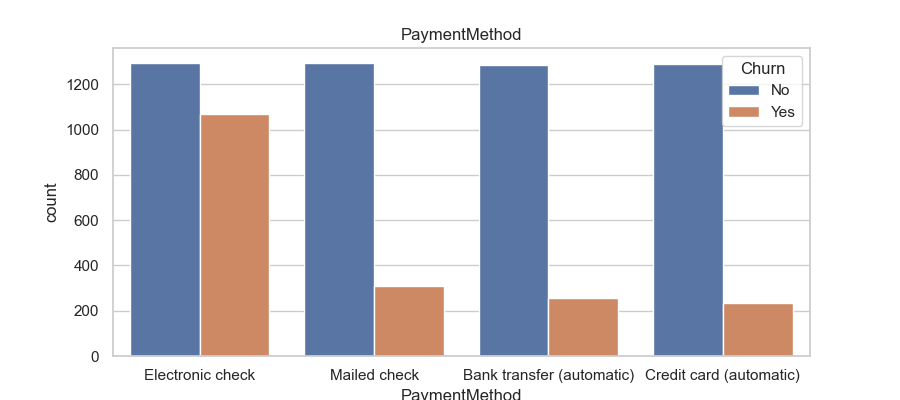

### Relationship Between Tenure, Internet Service Type, and Churn
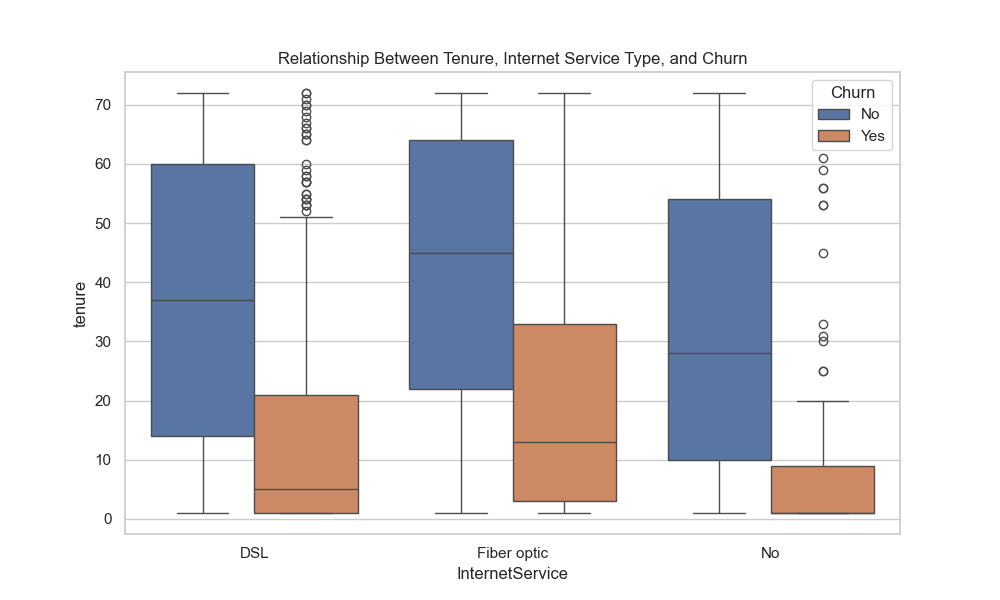

### Charges by Tenure
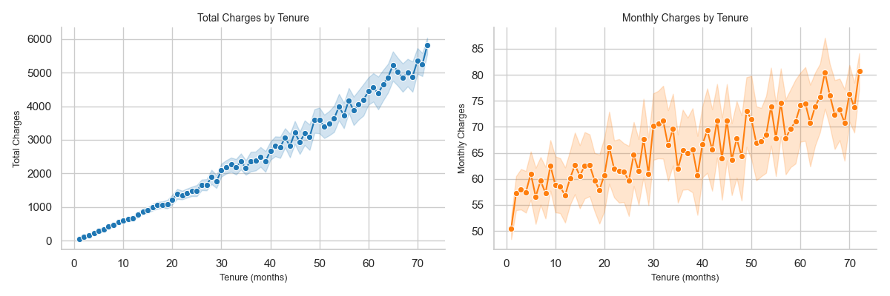

### Tenure by Churn 
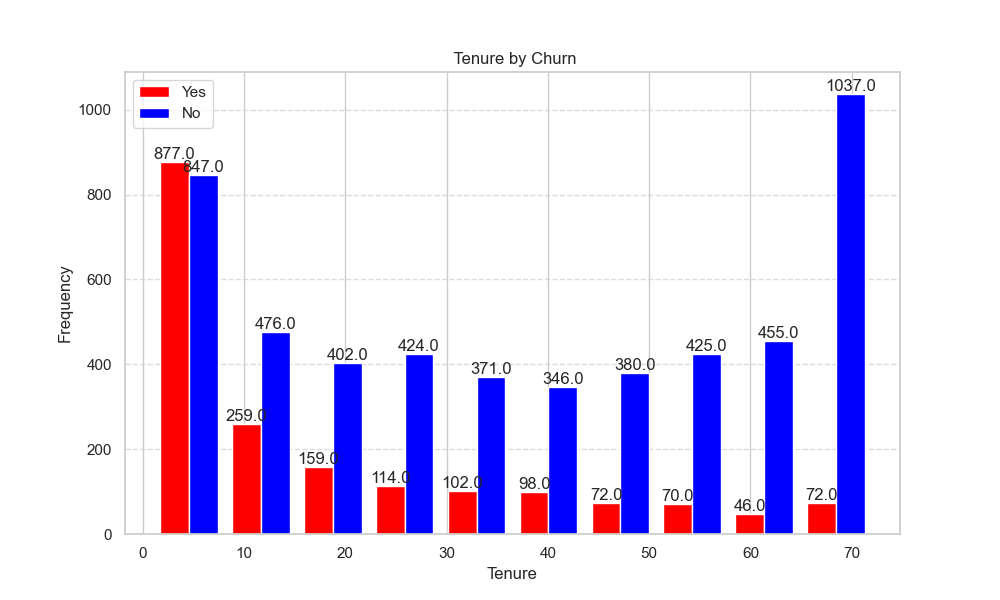

### MonthlyCharges by Churn
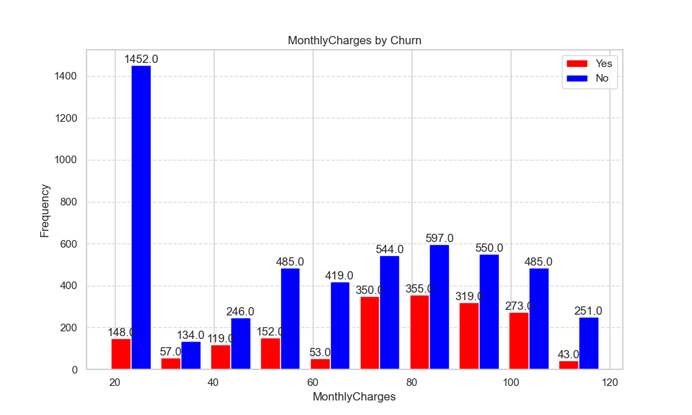

### Distributions of Total Charges, MonthlyCharges and Tenure by churn
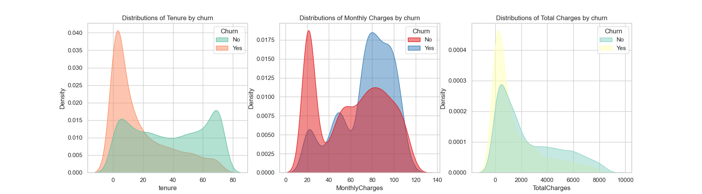

### Model Scores
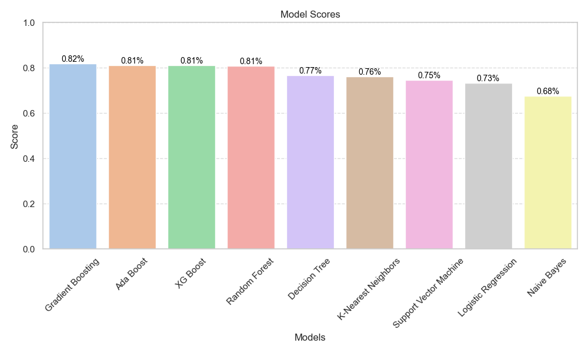

### Confusion Matrix
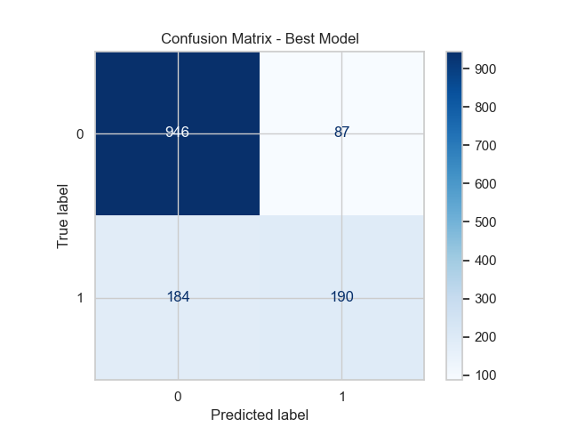

### Features Importance
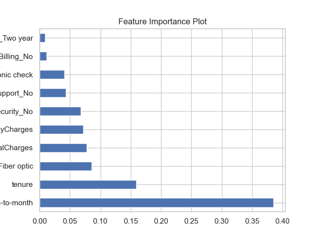

### ROC Curve - All Models
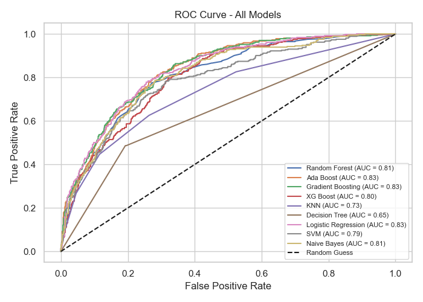

## Usage
1. Clone the repository:
   ```bash
   git clone https://github.com/MehmetHanifi1/Telco-Customer-Churn-Prediction.git
   cd Telco-Customer-Churn-Prediction
   pip install -r requirements.txt
   jupyter notebook ChurnPrediction.ipynb


